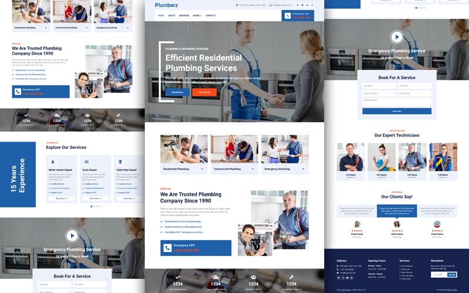

# Plumbing Website

> The purpose of this project is to build a Portfolio for a company specializing in the Plumbing industry.
> Live demo [_here_](https://www.example.com). <!-- If you have the project hosted somewhere, include the link here. -->

## General Information

- Provide website for Plumbing Company.
- Make an appointment for service via website 
- Pay for service directly via payment gateway
- Chat service for online support
<!-- You don't have to answer all the questions - just the ones relevant to your project. -->

## Technologies Used

- React.js
- Express.js
- Mongo DB
- Bootstrap
- Nginx
- AWS services for deployment

## Features

List the ready features here:

- CMS
- Book an appointment
- Pay for service - Payment Integration
- User Management
- Authentication
- Authorization
- Chat box support

## Screenshots

<!-- If you have screenshots you'd like to share, include them here. -->

## Setup

To be updated.

## Usage

To be Updated

## Project Status

Project is: Initialize
<!-- _in progress_ / _complete_ / _no longer being worked on_. If you are no longer working on it, provide reasons why. -->

## Acknowledgements

- This project was inspired by Plumbing Company that I worked for.

## Contact

Created by Thuy Le - feel free to contact me!

<!-- Optional -->
<!-- ## License -->
<!-- This project is open source and available under the [... License](). -->

